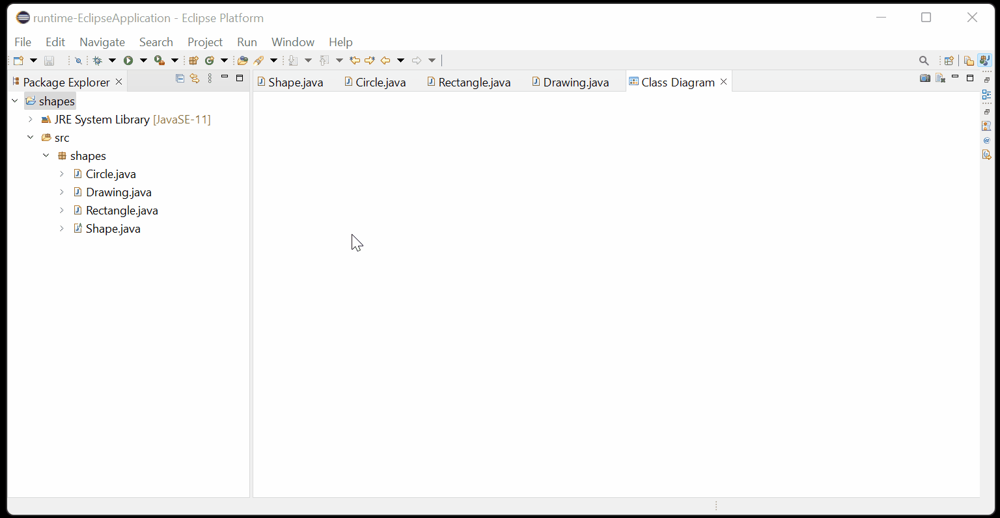

# Java Class Diagram for Eclipse

Automatically generate a simple class diagram in Eclipse from your java projects, packages or java files.

## Installation

Eclipse update-site:
https://rivasjm.github.io/class_diagram/

## Usage
